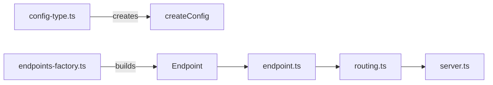

# Project Guide for AI Agents

This file provides essential context for working with the express-zod-api project.

---

## Project Overview

The **express-zod-api** is a TypeScript framework for building Express.js APIs with Zod schema validation. It provides
type-safe request/response handling, automatic OpenAPI documentation, and a clean API builder pattern.

- **Package manager**: pnpm
- **Current version** and **Node version**: See `express-zod-api/package.json`

---

## Project Structure

This is a pnpm monorepo. The directory name becomes the workspace name.

```
├── express-zod-api/   # Main package
│   ├── src/           # TypeScript source
│   └── tests/         # Unit tests (Vitest)
├── migration/         # Workspace: @express-zod-api/migration
├── example/           # Example API server
├── zod-plugin/        # Workspace: @express-zod-api/zod-plugin
├── cjs-test/          # CommonJS compatibility tests
├── esm-test/          # ESM compatibility tests
├── compat-test/       # Compatibility tests
└── issue952-test/     # Issue reproduction tests
```

### Workspaces

| Directory          | Package Name                  | Description                        |
| ------------------ | ----------------------------- | ---------------------------------- |
| `express-zod-api/` | `express-zod-api`             | Framework itself (main)            |
| `migration/`       | `@express-zod-api/migration`  | ESLint migration rules             |
| `zod-plugin/`      | `@express-zod-api/zod-plugin` | Zod plugin for schema enhancements |
| `example/`         | —                             | Usage example                      |

The rest are test workspaces.

---

## Architecture Overview

Quick reference on how the key modules connect:



See `src/index.ts` for the complete public API exports.

---

## Important Entry Points

- **`express-zod-api/src/index.ts`** — Public API exports (everything exported here is part of the public API)
- **`express-zod-api/src/config-type.ts`** — Configuration types for `createConfig()` function
- **`express-zod-api/src/routing.ts`** — Core routing logic
- **`express-zod-api/src/testing.ts`** — Test utilities (`testEndpoint`, `testMiddleware`, `makeRequestMock`, `makeResponseMock`, `makeLoggerMock`)
- **`express-zod-api/tests/express-mock.ts`** — Express mocking for tests
- **`migration/index.ts`** — Migration ESLint rules
- **`CHANGELOG.md`** — Version history and breaking changes

---

## Key Conventions

### 1. File Naming Conventions

- **Source files**: `src/*.ts`
- **Test files**: `tests/*.spec.ts` (Vitest)
- **Test organization**: In `express-zod-api` workspace, the `tests/` directory mirrors `src/`. Each source file has a corresponding test file with the same name.

### 2. Public API Convention

Everything exported via `express-zod-api/src/index.ts` is part of the public API.

### 3. JSDoc Convention for Public Entities

All properties of publicly available entities (exposed via `index.ts`) must have JSDoc documentation using these directives:

- **`@desc`**: Short description of what the property does
- **`@default`**: Default value (required for optional properties)
- **`@example`**: Example value (required for literal types, one per variant)

Each directive should aim to fit on one line:

```typescript
interface CommonConfig {
  /** @desc Enables cross-origin resource sharing. */
  cors: boolean | HeadersProvider;
  /** @desc Controls how to respond to a request with an invalid HTTP method. */
  /** @default true */
  /** @example true — respond with 405 and "Allow" header */
  /** @example false — respond with 404 */
  hintAllowedMethods?: boolean;
}
```

### 4. Import Conventions

Follow these rules to maintain consistency:

- **Zod**: Use named import `import { z } from "zod"`
- **Ramda**: Use namespace import `import * as R from "ramda"`
- **Node.js built-ins**: Use `node:` prefix `import { dirname } from "node:path"`
- **Type-only imports**: Use `import type` for types and interfaces (verbatimModuleSyntax)
- **Relative imports**: Must use `.ts` extension (not `.js`)

```typescript
import { z } from "zod";
import * as R from "ramda";
import { dirname } from "node:path";
import type { SomeType } from "./some-module";
import { someValue } from "./some-module.ts";
```

### 5. Type Declaration Convention

Object-based types should be declared as interfaces, not types:

```typescript
// Good
interface User {
  name: string;
  age: number;
}

// Avoid
type User = {
  name: string;
  age: number;
};
```

### 6. Testing Convention

- **Use `test.each()`**: Always prefer parameterized tests to reduce repetition
- **Placeholders**: Use `%s` for the current value and `%#` for the index

```typescript
test.each([true, false, undefined])(
  "Should handle hintAllowedMethods=%s",
  (hintAllowedMethods) => {},
);
```

- **Mock patterns**: Use utilities from `src/testing.ts` (`testEndpoint`, `testMiddleware`, `makeRequestMock`, `makeResponseMock`, `makeLoggerMock`) and Express mocks from `tests/express-mock.ts`:

```typescript
const { endpoint, loggerMock, requestMock, responseMock } = await testEndpoint({
  endpoint,
  requestProps: { method: "GET" },
  responseOptions: { locals: {} },
});
```

- **Test runner**: Vitest
- **Location**: `tests/` directories within each package
- **Run tests**: `pnpm test` (from root) or `pnpm test` (from package)

### 7. Configuration (config-type.ts)

Public API config uses `CommonConfig` interface with optional properties and JSDoc documentation:

```typescript
interface CommonConfig {
  /** @desc Description of what this config does */
  propertyName?: type; // default: value
}
```

### 8. API Building Pattern

```typescript
const factory = new EndpointsFactory(defaultResultHandler);
const endpoint = factory.build({
  method: "get",
  path: "/users",
  input: z.object({ ... }),
  output: z.object({ ... }),
  handler: async ({ input }) => ({ users: [] }),
});
```

### 9. Building

- **Build tool**: `tsdown`
- **Commands**: `pnpm build` (root builds all workspaces)

### 10. Line Length

- Maximum line length: 120 characters (including Markdown files)
- Use line breaks and code folding to stay within the limit

### 11. Code Refactoring

When extracting statements into new functions (or moving/refactoring code), preserve any inline comments from the source location:

```typescript
// Original:
if (entry.description) flat.description ??= entry.description; // can be empty

// After extracting (comment preserved in place):
const copyDescription = (entry, flat) => {
  if (entry.description) flat.description ??= entry.description; // can be empty
};
```

---

## Breaking Change Policy

Any breaking change to the public API requires an update to the migration script and its tests.

### Migration Organization

The migration is implemented as an ESLint rule in `migration/index.ts`:

1. **`Queries` interface** — defines AST node types to search for using esquery selectors
2. **`queries` object** — maps query names to esquery selectors
3. **`listen()` function** — connects queries to their handler functions in `create()`
4. **`create()` function** — implements the actual transformation (rename, value conversion, auto-fix)

**Tests** are in `migration/index.spec.ts` using `RuleTester`:

- `valid` — code that should NOT trigger the rule
- `invalid` — code that SHOULD be transformed, with expected `output` and error assertions

---

## CHANGELOG Convention

The `CHANGELOG.md` follows these rules:

- **Structure**: Nested in reverse order (the most recent version at top)
- **Level 2**: Major version title, e.g., `## Version N`
- **Level 3**: Specific version, e.g., `### vN.N.N` (semantic)
- **Changes**: Single list, may have nested items for clarifications
- **Punctuation**:
  - Item with nested items ends with `:`
  - Last item in a list ends with `.`
  - Other items end with `;`
- **Code samples**: Prefer a single sample below the list
- **Major releases** (vN.0.0): Use `diff` code block with `+`/`-` prefixes and spacing offset

---

## Common Tasks

### Building

```bash
pnpm build            # Build all workspaces
```

### Running Tests

**Note:** Build everything before testing everything, because `example` workspace depends on `express-zod-api`.

```bash
pnpm build              # Build all workspaces first
pnpm test               # Run all tests
pnpm -F express-zod-api test  # Run main package tests only
pnpm -F migration test        # Run migration tests
pnpm -F express-zod-api test -- --run routing  # Run specific test file
```

### Linting

```bash
pnpm lint             # Check lint and formatting
pnpm mdfix            # Fix formatting of markdown files
```
