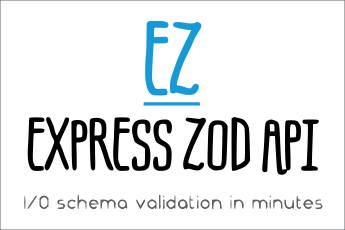

# Express Zod API 




Start your API server with I/O schema validation and custom middlewares in minutes.

1. [Technologies](#technologies)
2. [Concept](#concept)
3. [Installation](#installation)
4. [Basic usage](#basic-usage)
   1. [Set up config](#set-up-config)
   2. [Create an endpoints factory](#create-an-endpoints-factory)
   3. [Create your first endpoint](#create-your-first-endpoint)   
   4. [Set up routing](#set-up-routing)
   5. [Start your server](#start-your-server)
5. [Advanced usage](#advanced-usage)
   1. [Create a middleware](#create-a-middleware)
   2. [Refinements](#refinements)
   3. [Transformations](#transformations)
   4. [ResultHandler](#resulthandler)   
   5. [Your custom logger](#your-custom-logger)
   6. [Your custom server](#your-custom-server)
   7. [Multiple schemas for a single route](#multiple-schemas-for-a-single-route)
6. [Disclosing API specifications](#disclosing-api-specifications)
   1. [Reusing endpoint types on your frontend](#reusing-endpoint-types-on-your-frontend)
   2. [Swagger / OpenAPI Specification](#swagger--openapi-specification)
7. [Known issues](#known-issues)
   1. [Excess property check of endpoint output](#excess-property-check-of-endpoint-output)

[Changelog](CHANGELOG.md)

# Technologies

- [Typescript](https://www.typescriptlang.org/) first
- Schema validation — [Zod 3.x](https://github.com/colinhacks/zod) *(stable)*.
- Webserver — [Express.js](https://expressjs.com/).
- Logger — [Winston](https://github.com/winstonjs/winston).
- Swagger - [OpenAPI 3.x](https://github.com/metadevpro/openapi3-ts)

# Concept

The API always operates object schemas for input and output, including unions and intersections of object schemas (`.or()`, `.and()`).

The object being validated is the `request.query` for GET request, the `request.body` for PUT, PATCH and POST requests, or their merging for DELETE requests.

Middlewares can handle validated inputs and the original `request`, for example, to perform the authentication or provide the endpoint's handler with some request properties like the actual method.
The returns of middlewares are combined into the `options` parameter available to the next middlewares and the endpoint's handler.

The handler's parameter `input` combines the validated inputs of all connected middlewares along with the handler's one.
The result that the handler returns goes to the `ResultHandler` which is responsible for transmission of the final response or possible error.

All inputs and outputs are validated and there are also advanced powerful features like transformations and refinements.
The diagram below can give you a better idea of the dataflow.


# Installation

```shell
yarn add express-zod-api
# or
npm install express-zod-api
```

Add the following options to your `tsconfig.json` file in order to make it work as expected:

```json
{
  "compilerOptions": {
    "noImplicitAny": true,
    "strictNullChecks": true
  }
}
```

# Basic usage

*See full example [here](https://github.com/RobinTail/express-zod-api/tree/master/example).*

## Set up config

```typescript
import {ConfigType} from 'express-zod-api';

const config: ConfigType = {
  server: {
    listen: 8090,
  },
  cors: true,
  logger: {
    level: 'debug',
    color: true
  }
};
```
*See all available options [here](https://github.com/RobinTail/express-zod-api/blob/master/src/config-type.ts).*

## Create an endpoints factory

```typescript
import {EndpointsFactory} from 'express-zod-api';

const endpointsFactory = new EndpointsFactory();
```

You can also instantly add middlewares to it using `.addMiddleware()` method.

## Create your first endpoint

```typescript
import {z} from 'express-zod-api';

const setUserEndpoint = endpointsFactory.build({
  method: 'post',
  input: z.object({
    id: z.number(),
    name: z.string,
  }),
  output: z.object({
    timestamp: z.number(),
  }),
  handler: async ({input: {id, name}, options, logger}) => {
    logger.debug(`Requested id: ${id}`);
    logger.debug('Options:', options); // provided by middlewares
    return { timestamp: Date.now() };
  }
});
```

The endpoint can also handle multiple types of requests, this feature is available by using `methods` property that accepts an array.
You can also add middlewares to the endpoint by using `.addMiddleware()` before `.build()`.

## Set up routing

```typescript
import {Routing} from 'express-zod-api';

const routing: Routing = {
  v1: {
    setUser: setUserEndpoint
  }
};
```
This implementation sets up `setUserEndpoint` to handle requests to the `/v1/setUser` route.

## Start your server

```typescript
import {createServer} from 'express-zod-api';

createServer(config, routing);
```

# Advanced usage
## Create a middleware

You can create middlewares separately using `createMiddleware()` function and connect them later.
All returns of the connected middlewares are combined into the `options` argument of the endpoint's handler.
The inputs of middlewares are combined with the inputs of the endpoint's handler.

```typescript
import {
  createMiddleware, z, Method, createHttpError
} from 'express-zod-api';

// This one provides the method of the request to your 
// endpoint. It's useful for the ones that handle 
// multiple types of request (GET, POST, ...)
const methodProviderMiddleware = createMiddleware({
  input: z.object({}).nonstrict(),
  middleware: async ({request}) => ({
    method: request.method.toLowerCase() as Method,
  })
});

// This one performs the authentication using a key from 
// the input and a token from headers. It supplies the
// endpoint with a user from a database.
const authMiddleware = createMiddleware({
  input: z.object({
    key: z.string().nonempty()
  }),
  middleware: async ({input: {key}, request, logger}) => {
    logger.debug('Checking the key and token...');
    const user = await db.Users.findOne({key});
    if (!user) {
      throw createHttpError(401, 'Invalid key');
    }
    if (request.headers['token'] !== user.token) {
      throw createHttpError(401, 'Invalid token');
    }
    return { user };
  }
});
```

## Refinements

You can implement additional validation inside the schema:

```typescript
import {createMiddleware, z} from 'express-zod-api';

const authMiddleware = createMiddleware({
  input: z.object({
    key: z.string().nonempty()
      .refine((key) => key === '123', 'Invalid key')
  }),
  ...
})
```

## Transformations

Since parameters of GET requests come in the form of strings, there is often a need to transform them into numbers or arrays of numbers.

```typescript
import {z} from 'express-zod-api';

const getUserEndpoint = endpointsFactory.build({
  method: 'get',
  input: z.object({
    id: z.string().transform((id) => parseInt(id, 10)),
    ids: z.string().transform(
      (ids) => ids.split(',').map((id) => parseInt(id, 10))
    )
  }),
  output: z.object({...}),
  handler: async ({input: {id, ids}, logger}) => {
    logger.debug('id', id); // type: number
    logger.debug('ids', ids); // type: number[]
  }
});
```

## ResultHandler

`ResultHandler` is the [type](https://github.com/RobinTail/express-zod-api/blob/master/src/result-handler.ts) of function that is responsible for transmission of the final response or possible error.
The `defaultResultHandler` sets the HTTP status code and ensures the following type of the response:

```typescript
type ApiResponse<T> = {
  status: 'success',
  data: T
} | {
  status: 'error',
  error: {
    message: string;
  }
};
```

You have two options to customize the `ResultHandler`: globally or at the endpoint level:

```typescript
import {ConfigType, ResultHandler} from 'express-zod-api';

const resultHandler: ResultHandler = 
  ({error, input, output, request, response, logger}) => {};

const config: ConfigType = { resultHandler, ... };

// or
import {EndpointsFactory} from 'express-zod-api';

const endpointsFactory = new EndpointsFactory().setResultHandler(
  ({error, input, output, request, response, logger}) => {}
);
```

## Your custom logger

You can specify your custom Winston logger in config:

```typescript
import * as winston from 'winston';
import {ConfigType, createServer} from 'express-zod-api';

const config: ConfigType = {
  logger: winston.createLogger(),
  ...
};
createServer(config, routing);
```

## Your custom server

You can instantiate your own express app and connect your endpoints the following way.

```typescript
import * as express from 'express';
import {ConfigType, attachRouting} from 'express-zod-api';

const app = express();
const config: ConfigType = {app, ...};
const routing = {...};

attachRouting(config, routing);
app.listen();
```

**Please note** that in this case you probably need to: parse `request.body`, call `app.listen()` and handle `404` errors yourself;

## Multiple schemas for a single route

Thanks to the `DependsOnMethod` class a route may have multiple Endpoints attached depending on different methods.
It can also be the same Endpoint that handle multiple methods as well.
```typescript
import {DependsOnMethod} from 'express-zod-api';

// the route /v1/user has two Endpoints 
// which handle a couple of methods each
const routing: Routing = {
  v1: {
    user: new DependsOnMethod({
      get: myEndpointForGetAndDelete,
      delete: myEndpointForGetAndDelete,
      post: myEndpointForPostAndPatch,
      patch: myEndpointForPostAndPatch,
    })
  }
};
```

# Disclosing API specifications
## Reusing endpoint types on your frontend

You can export only the types of your endpoints for your front-end:

```typescript
export type MyEndpointType = typeof endpoint;
```

Then use provided helpers to obtain their input and output types:
```typescript
import {EndpointInput, EndpointOutput} from 'express-zod-api';
import {MyEndpointType} from '../your/backend';

type MyEndpointInput = EndpointInput<MyEndpointType>;
type MyEndpointOutput = EndpointOutput<MyEndpointType>;
```

## Swagger / OpenAPI Specification

You can generate the specification of your API the following way and write it to a `.yaml` file:

```typescript
import {OpenAPI} from 'express-zod-api';

const yamlString = new OpenAPI({
  routing, 
  version: '1.2.3',
  title: 'Example API',
  serverUrl: 'http://example.com'
}).builder.getSpecAsYaml();
```

# Known issues

## Excess property check of endpoint output

Unfortunately Typescript does not perform [excess property check](https://www.typescriptlang.org/docs/handbook/interfaces.html#excess-property-checks) for objects resolved in `Promise`, so there is no error during development of endpoint's output.

```typescript
import {z} from 'express-zod-api';

endpointsFactory.build({
  methods, input,
  output: z.object({
    anything: z.number()
  }),
  handler: async () => ({
    anything: 123,
    excessive: 'something' // no type error
  })
});
```

You can achieve this check by assigning the output schema to a constant and reusing it in additional definition of handler's return type:

```typescript
import {z} from 'express-zod-api';

const output = z.object({
  anything: z.number()
});

endpointsFactory.build({
  methods, input, output,
  handler: async (): Promise<z.input<typeof output>> => ({
    anything: 123,
    excessive: 'something' // error TS2322, ok!
  })
});
```
