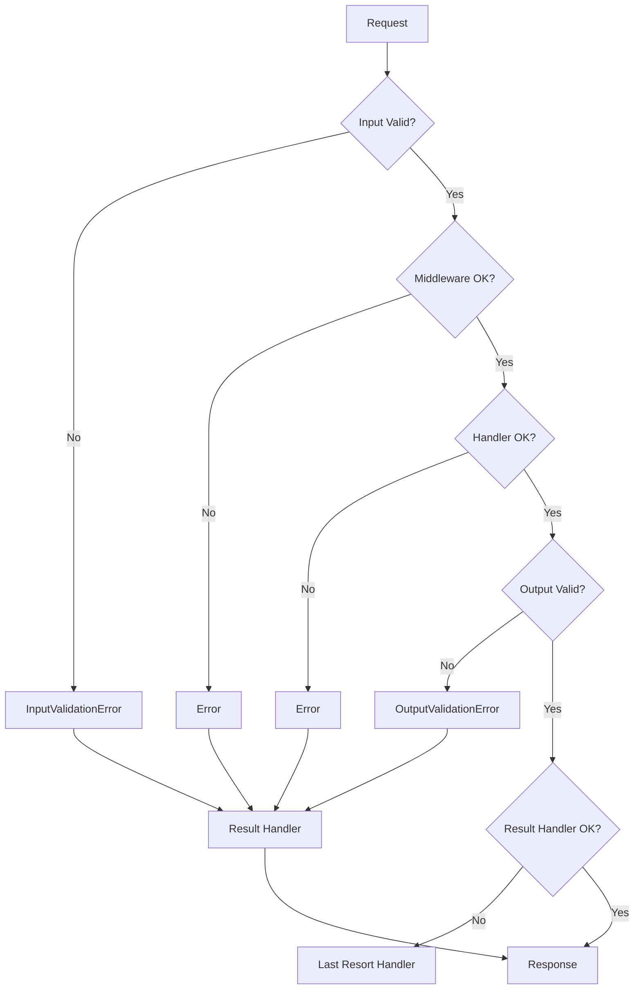

## Overview

Express Zod API provides a comprehensive error handling system that catches and processes errors from validation, endpoint execution, routing, and result handling. All errors are normalized and handled consistently, ensuring reliable API responses.

## Error Flow

Errors are handled at three distinct layers:

1. **Endpoint Layer**: Errors from input validation, middleware, and handler execution
2. **Routing Layer**: Errors from parsing, routing mismatches, and file uploads
3. **Result Handler Layer**: Errors from the Result Handler itself (last resort)



## Error Types

### InputValidationError

Thrown when request data doesn't match the input schema:

```typescript
import { InputValidationError } from "express-zod-api";

const endpoint = factory.build({
  input: z.object({
    age: z.number(),
  }),
  handler: async ({ input }) => {
    // If request has age: "abc", InputValidationError is thrown
  },
});
```

**Default behavior:**
- Status code: `400 Bad Request`
- Includes Zod validation error details
- Handled by the endpoint's Result Handler

### OutputValidationError

Thrown when handler returns data that doesn't match the output schema:

```typescript
import { OutputValidationError } from "express-zod-api";

const endpoint = factory.build({
  output: z.object({
    count: z.number(),
  }),
  handler: async () => {
    // This throws OutputValidationError
    return { count: "not a number" };
  },
});
```

**Default behavior:**
- Status code: `500 Internal Server Error`
- Indicates a server-side bug
- Handled by the endpoint's Result Handler

<Warning>
  `OutputValidationError` means your code has a bug. The handler is returning data that doesn't match its declared output schema.
</Warning>

### HttpError

Explicitly thrown errors with HTTP status codes:

```typescript
import createHttpError from "http-errors";

const endpoint = factory.build({
  handler: async ({ input }) => {
    const user = await db.users.find(input.id);
    
    if (!user) {
      throw createHttpError(404, "User not found");
    }
    
    if (!user.active) {
      throw createHttpError(403, "User account is disabled");
    }
    
    return user;
  },
});
```

**Default behavior:**
- Uses the error's `statusCode` property
- Message exposure controlled by `expose` property
- Handled by the endpoint's Result Handler

### RoutingError

Thrown during route initialization if routing configuration is invalid:

```typescript
import { RoutingError } from "express-zod-api";

// Duplicate route
const routing = {
  user: getUserEndpoint,
  "get /user": getUserEndpoint, // RoutingError: duplicate
};

// Method not supported
const getOnlyEndpoint = factory.build({ method: "get" });
const routing2 = {
  "post /users": getOnlyEndpoint, // RoutingError: unsupported method
};
```

**Behavior:**
- Thrown at server startup (before handling requests)
- Application should not start with routing errors
- Includes `cause: { method, path }`

### DocumentationError

Thrown when generating OpenAPI documentation if schemas are incompatible:

```typescript
import { DocumentationError } from "express-zod-api";

// Thrown during Documentation generation if schema issues exist
```

**Behavior:**
- Only occurs during documentation generation
- Indicates schema definition problems
- Includes context about which endpoint caused the issue

### ResultHandlerError

Thrown when the Result Handler itself fails:

```typescript
import { ResultHandlerError } from "express-zod-api";

// If your Result Handler throws an error,
// it's wrapped in ResultHandlerError
```

**Behavior:**
- Handled by the Last Resort Handler
- Results in 500 status with plain text response
- Indicates a serious implementation error

## Throwing Errors

### Using createHttpError

The recommended way to throw errors with specific status codes:

```typescript
import createHttpError from "http-errors";

const endpoint = factory.build({
  handler: async ({ input }) => {
    // 400 Bad Request
    if (!input.email.includes("@")) {
      throw createHttpError(400, "Invalid email format");
    }
    
    // 401 Unauthorized
    if (!isAuthenticated(input.token)) {
      throw createHttpError(401, "Invalid authentication token");
    }
    
    // 403 Forbidden
    if (!hasPermission(input.userId)) {
      throw createHttpError(403, "Insufficient permissions");
    }
    
    // 404 Not Found
    const user = await db.users.find(input.id);
    if (!user) {
      throw createHttpError(404, "User not found");
    }
    
    // 409 Conflict
    if (await db.users.exists({ email: input.email })) {
      throw createHttpError(409, "Email already registered");
    }
    
    // 429 Too Many Requests
    if (rateLimitExceeded(input.userId)) {
      throw createHttpError(429, "Rate limit exceeded");
    }
    
    // 500 Internal Server Error (default)
    throw createHttpError(500, "Something went wrong");
  },
});
```

### Error Exposure in Production

Control whether error messages are shown to clients:

```typescript
import createHttpError from "http-errors";

// NODE_ENV=production

// ✅ Message shown to client (4XX errors expose by default)
throw createHttpError(401, "Invalid credentials");
// Response: "Invalid credentials"

// ✅ Message shown to client (explicit expose)
throw createHttpError(500, "Database connection failed", { expose: true });
// Response: "Database connection failed"

// ❌ Message hidden from client (5XX errors don't expose by default)
throw createHttpError(500, "Secret internal error");
// Response: "Internal Server Error" (generic)

// ❌ Message hidden from client (explicit)
throw createHttpError(401, "Secret auth details", { expose: false });
// Response: "Unauthorized" (generic)
```

<Info>
  In development mode, all error messages are exposed regardless of the `expose` property.
</Info>

### Regular Errors

Regular JavaScript errors are converted to 500 Internal Server Error:

```typescript
const endpoint = factory.build({
  handler: async () => {
    // Becomes 500 Internal Server Error
    throw new Error("Something broke");
    
    // Unhandled promise rejection -> 500
    await failingAsyncFunction();
  },
});
```

## Error Handling in Different Layers

### In Endpoints

Endpoint errors are handled by the endpoint's Result Handler:

```typescript
const endpoint = factory.build({
  input: z.object({ id: z.string() }),
  output: z.object({ name: z.string() }),
  handler: async ({ input }) => {
    // InputValidationError if input doesn't match schema
    // (automatic)
    
    // HttpError from business logic
    const item = await db.find(input.id);
    if (!item) {
      throw createHttpError(404, "Not found");
    }
    
    // OutputValidationError if return doesn't match schema
    return { name: item.name };
  },
});

// All errors handled by the endpoint's Result Handler
// (defaultResultHandler by default)
```

### In Middlewares

Middleware errors stop the chain and go to the Result Handler:

```typescript
const authMiddleware = new Middleware({
  input: z.object({ token: z.string() }),
  handler: async ({ input }) => {
    // InputValidationError if token missing/invalid type
    
    const user = await verifyToken(input.token);
    if (!user) {
      // Stops middleware chain, goes to Result Handler
      throw createHttpError(401, "Invalid token");
    }
    
    return { user };
  },
});
```

### In Result Handlers

Result Handler errors are handled by the Last Resort Handler:

```typescript
const resultHandler = new ResultHandler({
  positive: (output) => z.object({ data: output }),
  negative: z.object({ error: z.string() }),
  handler: ({ error, output, response }) => {
    if (error) {
      // If this throws, Last Resort Handler catches it
      const code = error.statusCode || 500;
      return void response.status(code).json({ error: error.message });
    }
    
    // If this throws, Last Resort Handler catches it
    response.json({ data: output });
  },
});
```

### Routing and Parsing Errors

Configured via the `errorHandler` option:

```typescript
import { createConfig, defaultResultHandler } from "express-zod-api";

const config = createConfig({
  errorHandler: defaultResultHandler, // or custom Result Handler
});
```

Handles:
- **404 Not Found**: No matching route
- **405 Method Not Allowed**: Route exists but method not supported
- **Parsing errors**: Invalid JSON, upload issues, etc.

## Custom Error Handler

Create a custom Result Handler for error formatting:

```typescript
import { ResultHandler, ensureHttpError, logServerError } from "express-zod-api";
import { z } from "zod";

const customErrorHandler = new ResultHandler({
  positive: (output) => z.object({ data: output }),
  negative: z.object({
    error: z.object({
      code: z.string(),
      message: z.string(),
      details: z.any().optional(),
    }),
  }),
  handler: ({ error, input, output, request, response, logger }) => {
    if (error) {
      const httpError = ensureHttpError(error);
      
      // Log server errors (5XX)
      logServerError(httpError, logger, request, input);
      
      return void response.status(httpError.statusCode).json({
        error: {
          code: httpError.name,
          message: httpError.message,
          details: httpError.cause,
        },
      });
    }
    
    response.status(200).json({ data: output });
  },
});

// Use in factory
const factory = new EndpointsFactory(customErrorHandler);

// Use as global error handler
const config = createConfig({
  errorHandler: customErrorHandler,
});
```

## Error Helpers

### ensureHttpError

Converts any error to an HttpError:

```typescript
import { ensureHttpError } from "express-zod-api";

const httpError = ensureHttpError(error);
// InputValidationError -> 400
// OutputValidationError -> 500
// HttpError -> preserves statusCode
// Other Error -> 500
```

### getMessageFromError

Extracts error message safely:

```typescript
import { getMessageFromError } from "express-zod-api";

const message = getMessageFromError(error);
// Returns error.message or "Unknown error"
```

### logServerError

Logs server-side errors (5XX):

```typescript
import { logServerError } from "express-zod-api";

logServerError(httpError, logger, request, input);
// Only logs if error.expose is false (server-side errors)
```

### getPublicErrorMessage

Gets the message safe to show to clients:

```typescript
import { getPublicErrorMessage } from "express-zod-api";

const publicMessage = getPublicErrorMessage(httpError);
// In production + !expose: generic message for status code
// Otherwise: actual error message
```

## Last Resort Handler

When the Result Handler itself fails, the Last Resort Handler sends a minimal response:

```typescript
// Response format
HTTP/1.1 500 Internal Server Error
Content-Type: text/plain

ResultHandlerError: <error message>
```

<Warning>
  If you see Last Resort Handler responses in production, there's a critical bug in your Result Handler implementation.
</Warning>

## Best Practices

<Tip>
  1. **Use createHttpError**: Always throw `HttpError` instances with specific status codes
  2. **Validate early**: Let Zod schemas handle input validation
  3. **Be specific**: Use appropriate status codes (404, 403, 409, etc.)
  4. **Hide sensitive info**: Use `expose: false` for internal error details
  5. **Log server errors**: Use `logServerError()` for debugging
  6. **Test error paths**: Verify error handling works as expected
  7. **Document errors**: List possible error responses in API documentation
</Tip>

## Common Patterns

### Resource Not Found

```typescript
const user = await db.users.findById(input.id);
if (!user) {
  throw createHttpError(404, "User not found");
}
```

### Unauthorized Access

```typescript
if (!isValidToken(input.token)) {
  throw createHttpError(401, "Invalid or expired token");
}
```

### Forbidden Operation

```typescript
if (ctx.user.role !== "admin") {
  throw createHttpError(403, "Admin privileges required");
}
```

### Resource Conflict

```typescript
const existing = await db.users.findByEmail(input.email);
if (existing) {
  throw createHttpError(409, "Email already registered");
}
```

### Rate Limiting

```typescript
if (await isRateLimited(ctx.user.id)) {
  throw createHttpError(429, "Too many requests, please try again later");
}
```

### Validation with Context

```typescript
const endpoint = factory.build({
  input: z.object({
    newEmail: z.string().email(),
  }),
  handler: async ({ input, ctx }) => {
    if (input.newEmail === ctx.user.currentEmail) {
      throw createHttpError(400, "New email must be different");
    }
    // ...
  },
});
```

## Testing Error Handling

```typescript
import { testEndpoint } from "express-zod-api";
import createHttpError from "http-errors";

test("should return 404 when user not found", async () => {
  const endpoint = factory.build({
    handler: async () => {
      throw createHttpError(404, "User not found");
    },
  });
  
  const { responseMock } = await testEndpoint({ endpoint });
  
  expect(responseMock._getStatusCode()).toBe(404);
  expect(responseMock._getJSONData()).toMatchObject({
    status: "error",
    error: { message: "User not found" },
  });
});

test("should return 400 for invalid input", async () => {
  const endpoint = factory.build({
    input: z.object({ age: z.number() }),
    handler: async () => ({}),
  });
  
  const { responseMock } = await testEndpoint({
    endpoint,
    requestProps: { body: { age: "not a number" } },
  });
  
  expect(responseMock._getStatusCode()).toBe(400);
});
```

## See Also

- [Endpoints](/concepts/endpoints) - Endpoint error handling
- [Middleware](/concepts/middleware) - Middleware error handling  
- [Result Handlers](/concepts/result-handlers) - Custom error formatting